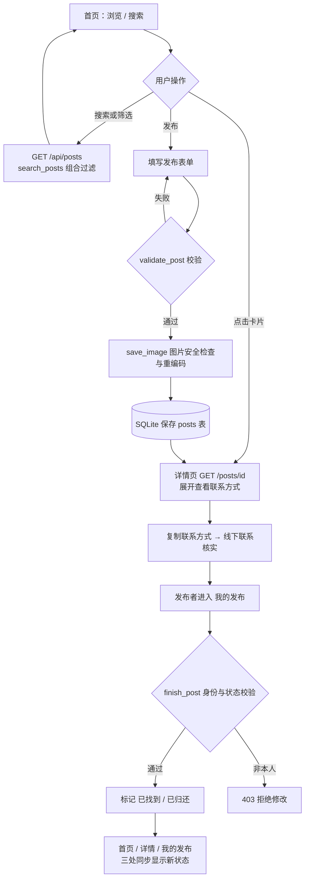
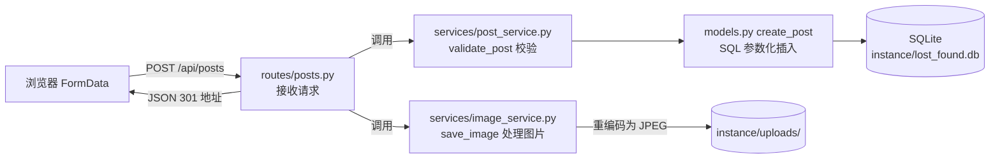
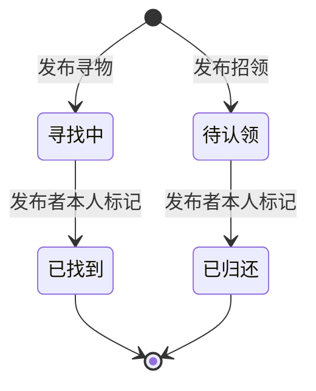

# 2026秋软件工程第二次结对作业：校园失物招领程序实现

| 项目 | 内容 |
|---|---|
| 这个作业属于哪个课程 | 2026 软件工程 |
| 这个作业要求在哪里 | [2026秋软件工程第二次结对作业之程序实现](https://edu.cnblogs.com/campus/fzu/202601SofwareEngineering/homework/16744) |
| 这个作业的目标 | 基于第一次结对作业的原型，实现"发布信息—浏览或搜索—查看详情—联系发布者—更新状态"的完整流程 |
| 结对成员（学号、姓名） | 102401121张智轩；102401203连向薇 |
| 我的GitHub | https://github.com/zzx0607 |
| 结对同学的GitHub| 待填写 |
| GitHub 项目地址 | https://github.com/zzx0607/102401121-102401203 |


---

## 一、具体分工

| 成员 | 主要分工 | 验收重点 |
|---|---|---|
| 张智轩 | 整体架构与后端：Flask 应用工厂、数据库层（database.py / models.py）、发布校验、状态更新与权限、图片处理、单元测试 | 数据能否正确保存，谁可以修改状态，异常输入如何被拒绝 |
| 连向薇 | 页面与交互：模板（templates/）、样式（static/css）、表单交互与复制联系方式、返回列表恢复位置、Chrome 走查、README 与博客整理 | 页面流程是否连贯，空结果与错误提示是否友好，说明与程序是否一致 |
| 共同 | 核对第一次原型、统一接口字段约定、交叉走查寻物与招领两条流程、GitHub 协作与签入 | 从发布到结束的完整流程，文档与程序一致 |


---

## 二、PSP 表格


| PSP2.1 | Personal Software Process Stages | 预估耗时（分钟） | 实际耗时（分钟） |
|---|---|---|---|
| **Planning** | 计划 | 40 | 30 |
| · Estimate | 估计这个任务需要多少时间 | 40 | 30 |
| **Development** | 开发 | 435 | 525 |
| · Analysis | 需求分析（包括学习新技术） | 60 | 90 |
| · Design Spec | 生成设计文档 | 30 | 25 |
| · Design Review | 设计复审 | 20 | 15 |
| · Coding Standard | 代码规范 | 15 | 10 |
| · Design | 具体设计 | 40 | 50 |
| · Coding | 具体编码 | 180 | 220 |
| · Code Review | 代码复审 | 30 | 40 |
| · Test | 测试（自我测试，修改代码，提交修改） | 60 | 80 |
| **Reporting** | 报告 | 60 | 70 |
| · Test Report | 测试报告 | 30 | 35 |
| · Size Measurement | 计算工作量 | 10 | 10 |
| · Postmortem & Process Improvement Plan | 事后总结，并提出过程改进计划 | 20 | 25 |
| **合计** | | **535** | **625** |

超时分析：实际比预估多约 90 分钟，主要集中在三处——
① **需求分析**：第一次做 CSRF 防护、Session 身份和图片安全处理，需要先弄懂"为什么需要"再写，学习时间超出预估；
② **具体编码**：前后端字段命名没有一开始完全对齐（`name/place/time/type/cat/done` 与数据库早期设计不一致），联调时返工统一，属于设计阶段没锁死接口约定的代价；
③ **测试**：权限矩阵（本人/他人/无 Cookie）和图片异常（假图片/超大图/解压炸弹）的用例构造比预想更花心思。
相比之下，设计文档和代码规范因为沿用了第一次作业的原型，比预估完成得快。

---

## 三、解题思路描述与设计实现说明

### 3.1 代码实现思路

题目要求实现"发布寻物/招领 → 集中浏览 → 关键词搜索 → 查看详情与联系方式 → 发布者标记已找到/已归还"的闭环。结合第一次作业的原型，我们选择 **WEB 方案，后端用 Python Flask + SQLite**，理由有三：

1. **数据真正跨浏览器共享**：纯前端方案的数据只存在本机浏览器，而失物招领的本质是"我发布的、你能看到"。Flask + SQLite 让任何打开站点的人都能看到别人发布的信息，刷新、重启都不丢，更接近真实产品。
2. **单元测试友好**：业务规则（校验、搜索、权限、状态）全部抽成不碰 HTTP 的纯函数放进 `services/`，pytest 可以直接导入测试；Flask 自带的 test_client 又能在不启动真实服务器的情况下测完整接口。
3. **部署简单**：Python 3.10 + `pip install -r requirements.txt` 就能跑，不需要 Node.js、MySQL 或线上服务器，助教和同学容易复现。

整个应用按四层组织，数据流是单向的：

```
用户操作 → routes/（HTTP 入口：解析参数、拼装响应）
                ├─→ services/（业务规则：校验、搜索、状态、图片，纯逻辑）
                ├─→ models/（数据访问：SQL 参数化执行，无业务判断）
                └─→ database.py（连接 SQLite，建表，请求结束关闭连接）
```

这样做的最大好处是关注点分离：改界面不碰逻辑，改校验规则不影响 SQL，`services/` 里的函数可以在测试里用任意数据直接验证。

**身份与权限**：不实现登录，但需要"只有发布者能修改"。首次访问时后端在签名 Session 里写入随机 `visitor_id`，发布记录时把该 ID 存进 `owner_id` 字段；"我的发布"只查当前 `visitor_id` 的记录，结束/删除接口在后端再次校验 `owner_id` 是否匹配。清除 Cookie 会失去原身份，这在 README 边界里如实说明。

### 3.2 关键流程与数据流图

**核心业务流程**（发布、浏览/搜索、详情联系、状态更新四条线）：



**分层数据流图**（一条发布请求经过的层次）：



**状态机**（谁修改、从哪个入口改、改完在哪里看到）：



- **谁修改**：只有发布者本人（后端 `require_owner` 校验 `owner_id == visitor_id`，不信任前端按钮是否显示）；
- **入口**："我的发布"列表里每条记录下的"标记为已找到/已归还"按钮（寻物显示"已找到"，招领显示"已归还"）；
- **结果**：数据库 `done` 字段置 1，首页卡片、详情页、我的发布三处读取同一条记录，状态标签同步变化；已结束记录默认仍在列表中可见，首页可通过"信息状态"筛选查看"进行中/已结束"。

### 3.3 重要代码片段及解释

**① 发布校验（services/post_service.py）——结构化报错，便于测试**

```python
def validate_post(raw):
    limits = {'name':40, 'place':60, 'contact':80, 'time':40, 'description':500}
    result = {}
    for key, limit in limits.items():
        value = raw.get(key, '')
        if not isinstance(value, str):
            raise PostError('字段必须为文字')
        result[key] = value.strip()
        if len(result[key]) > limit:
            raise PostError(f'{key} 超出 {limit} 字限制')
    for key, label in [('name','物品名称'), ('place','地点'), ('contact','联系方式')]:
        if not result[key]:
            raise PostError(f'请填写{label}')
    result['type'] = raw.get('type', '')
    result['cat'] = raw.get('cat', '其他')
    if result['type'] not in ('寻物', '招领'):
        raise PostError('请选择寻物或招领')
    if result['cat'] not in CATEGORIES:
        raise PostError('物品类别不正确')
    return result
```

值得保留的一点：校验函数只接收原始表单、返回清洗后的字典，失败时抛出带 HTTP 状态码的 `PostError`。App 里注册了 `errorhandler(PostError)`：API 路径返回 `{"error": "具体原因"}`，页面路径渲染 error.html。错误提示对应到具体字段，而不是笼统的"发布失败"。

**② 状态更新的权限链（services/post_service.py + models.py）——界面按钮只是入口，后端才是边界**

```python
def require_owner(post_id, owner_id):
    post = require_post(post_id)
    if post['owner_id'] != owner_id:
        raise PostError('只有发布者可以修改这条信息', 403)
    return post

def finish(post_id, owner_id):
    require_owner(post_id, owner_id)
    models.finish_post(post_id, owner_id)
    return require_post(post_id)
```

```python
def finish_post(post_id, owner_id):
    """仅发布者本人可以结束进行中的记录；重复结束不改变任何数据。"""
    db = get_db()
    with db:
        cursor = db.execute(
            "UPDATE posts SET done=1 WHERE id=? AND owner_id=? AND done=0",
            (post_id, owner_id))
    return cursor.rowcount > 0
```

即使绕过前端直接请求 `PATCH /api/posts/<id>/finish`，SQL 的 WHERE 条件也同时检查了"是本人"和"仍在进行中"——不是本人改不了，重复标记也不会覆盖任何数据（接口约定：重复结束返回 200 且不产生副作用）。

**③ 搜索与组合筛选（services/search_service.py）——多词 AND、全角/大小写无关**

```python
def search_posts(posts, q='', type='', cat='', place='', status=''):
    # Python 字符串匹配，% 和 _ 也作为普通字符处理。
    words = q.strip().casefold().split()
    result = []
    for post in posts:
        haystack = ' '.join(post[k] for k in ('name','cat','place','description')).casefold()
        if not all(word in haystack for word in words):
            continue
        if type and post['type'] != type or cat and post['cat'] != cat:
            continue
        if place.strip().casefold() not in post['place'].casefold():
            continue
        if status == 'active' and post['done'] or status == 'done' and not post['done']:
            continue
        result.append(post)
    return result
```

关键词按空格拆词，每个词都必须命中名称/类别/地点/描述之一；`casefold()` 让英文大小写和全角字符不影响匹配；地点筛选是"包含"而非"相等"，输入"明理楼"也能命中"明理楼 B203"。这里特意用 Python 字符串匹配而非 SQL LIKE，是为了让 `%`、`_` 这类字符按字面处理，避免测试人员输入百分号时出现意外结果（测试里专门有一条 `q=%25` 的用例）。
### 3.4 运行成果展示
1.首页信息

2.发布信息


3.发布成功页面

4.更新状态(已归还，已找到）

5.关键字搜索


---

## 四、附加特点设计与展示


**
### 4.1 相似线索推荐

**设计的意义**：用户丢了东西，最值得看的往往不是全部列表，而是"有人捡到了和我丢的同类物品吗"。详情页底部推荐"同类别的相反类型信息"（看寻物时推荐招领，反之亦然），且只推荐仍在进行中的，地点相同的排在最前。

**实现思路**：纯函数 `similar_posts`，输入当前记录与全量列表，先过滤再按（地点相同，发布时间新）双键排序，最多取 3 条：

```python
def similar_posts(target, posts):
    # 同类别、相反类型且未结束的记录，仅作为参考线索，地点相同优先。
    found = [p for p in posts if p['id'] != target['id'] and not p['done']
             and p['type'] != target['type'] and p['cat'] == target['cat']]
    return sorted(found, key=lambda p:(p['place']==target['place'], p['id']), reverse=True)[:3]
```

**成果展示**：在详情页发布一条"寻物·水杯"后，同类别招领卡片出现在"可能相关的线索"区块。


### 4.2 图片安全检查与重编码

**设计的意义**：图片是用户最直接的上传内容，也是最容易出问题的地方：伪造扩展名的脚本文件、几万像素的解压炸弹、带 EXIF 的原图，都可能拖垮服务器或带来安全风险。前端选择时只做第一道提示，真正的检查都在后端。

**实现思路**：`save_image` 不信任客户端文件名，用 Pillow 重新打开、验证、转 RGB、缩略到 1600px 内，再用服务端生成的 UUID 文件名存为 JPEG（扩展名和内容都由服务器决定，杜绝路径穿越）；同时把 Pillow 默认只是警告的 DecompressionBombWarning 升级为异常：

```python
with warnings.catch_warnings():
    warnings.simplefilter('error', Image.DecompressionBombWarning)
    with Image.open(BytesIO(content)) as im:
        if im.format not in ('JPEG','PNG','WEBP'):
            raise PostError('仅支持 JPG、PNG、WebP 图片')
        if im.width * im.height > 20_000_000:
            raise PostError('图片像素过大，请压缩后上传')
        im.verify()
```

**成果展示**：上传 20×20 的 PNG 测试图片，返回的 `image` 字段是 `.jpg` 后缀的随机名；上传内容为 `<script>` 的"假 PNG"返回 400；超过 5MB 返回 400，请求体超过 6MB 返回 413。

### 4.3 一键复制联系方式 + 手动降级

**设计的意义**：从"看到"到"联系"是流程中最容易断的一步，手动抄写号码会抄错。点击一次复制，直接去加微信或拨号。

**实现思路**：优先调用浏览器的 Clipboard API；本地开发走 `http://127.0.0.1` 是安全上下文，正常可用。若浏览器拒绝（如某些无痕模式），自动选中联系方式文字并提示按 Ctrl+C，保证操作永远有下一步：

```javascript
document.getElementById('copyContact')?.addEventListener('click', async () => {
  const element = document.getElementById('contactText');
  try { await navigator.clipboard.writeText(element.textContent); toast('联系方式已复制'); }
  catch {
    const selection = window.getSelection(), range = document.createRange();
    range.selectNodeContents(element); selection.removeAllRanges(); selection.addRange(range);
    toast('自动复制不可用，已选中联系方式，请按 Ctrl+C 复制');
  }
});
```

### 4.4 返回列表时恢复筛选条件与滚动位置

**设计的意义**：从首页翻了几屏点进详情，返回时却回到列表顶部、筛选条件全丢，是列表类页面最常见的恼人体验。

**实现思路**：首页点击卡片时把当前筛选 URL 和滚动位置写入 sessionStorage；详情页把"返回首页"链接替换为带原筛选条件的地址；回到首页时若地址匹配则恢复滚动位置：

```javascript
const LIST_KEY = 'listState';
if (document.getElementById('searchForm')) {
  document.querySelectorAll('.card').forEach(link => link.addEventListener('click', () => {
    sessionStorage.setItem(LIST_KEY, JSON.stringify({scrollY: window.scrollY, search: location.search}));
  }));
  const raw = sessionStorage.getItem(LIST_KEY);
  if (raw) {
    sessionStorage.removeItem(LIST_KEY);
    try {
      const saved = JSON.parse(raw);
      if ((saved.search || '') === location.search) window.scrollTo(0, saved.scrollY || 0);
    } catch { /* 损坏的记录直接丢弃 */ }
  }
}
```

### 4.5 安全基线

**设计的意义**：作业虽然不需要登录系统，但程序会被同学公开测试，"别人发的数据会不会污染我的浏览器、别人能不能改我的信息"是必须回答的问题。

**实现思路**：三道防线——① 所有 SQL 都走参数化查询（`models.py` 里没有任何字符串拼接），SQL 注入无从下手；② 所有写操作要求 Session 内随机生成的 CSRF Token 与请求头一致（`secrets.compare_digest` 常量时间比较），跨站伪造请求被 403 拒绝；③ 模板默认自动转义，用户发布的 `<script>` 会以文本形式显示。此外响应头统一附加 CSP、`nosniff` 等安全头。

---

## 五、目录说明与使用说明

### 5.1 目录组织

```
campus-lost-found/
├── app.py                  # 启动入口：应用工厂、Session 与 CSRF、错误处理、安全响应头
├── config.py               # 配置：数据库/上传目录路径、请求体与图片大小上限
├── database.py             # SQLite 连接、建表 Schema、请求结束自动关闭连接
├── models.py               # 数据访问层：create/get/list/finish/delete，全部 SQL 参数化
├── requirements.txt        # 依赖：Flask、Pillow、pytest
├── pytest.ini              # 测试配置（testpaths = tests）
├── README.md               # 目录说明与使用说明
├── routes/
│   ├── __init__.py         # register_routes 注册两个蓝图
│   ├── pages.py            # 页面路由：首页/发布/详情/我的发布/图片访问
│   └── posts.py            # API 路由：/api/posts 增查改删，输出 JSON
├── services/
│   ├── post_service.py     # 发布校验、权限检查、状态更新、状态文案
│   ├── search_service.py   # 关键词搜索、组合筛选、相似线索推荐
│   └── image_service.py    # 图片校验、防解压炸弹、重编码保存与删除
├── templates/              # Jinja2 模板（base 布局 + 各页面）
│   ├── base.html           # 布局、CSRF meta、导航栏、toast
│   ├── index.html          # 首页：搜索、类型/类别/状态/地点筛选、卡片列表
│   ├── publish.html        # 发布表单（含图片预览）
│   ├── detail.html         # 详情、联系方式、相似线索
│   ├── my_posts.html       # 我的发布：标记结束、删除
│   ├── _cards.html         # 卡片与图标宏（内联 SVG，无外部素材）
│   └── error.html          # 错误页
├── static/
│   ├── css/style.css       # 全部样式（紫色主题，手机优先布局）
│   └── js/
│       ├── app.js          # 发布提交、标记/删除、复制联系方式、浏览位置记忆
│       └── image-reader.js # 图片选择预览与前端初检
├── tests/                  # 单元测试（22 个用例）
│   ├── conftest.py         # fixtures：临时数据库 app/client、CSRF 工具
│   ├── test_posts.py       # 发布/结束/删除/权限/CSRF/转义
│   ├── test_search.py      # 搜索与筛选、相似线索
│   ├── test_database.py    # 持久化与事务回滚
│   └── test_images.py      # 图片上传的四种情况
├── docs/                   # 接口约定、测试说明、PSP 记录、本博客、流程图
└── instance/               # 运行时生成：数据库、上传图片、secret.key（已被 .gitignore 忽略）
```

### 5.2 测试人员如何运行

需要 Python 3.10 及以上（无需 Node.js、MySQL）。**Windows**（PowerShell，在 `campus-lost-found` 文件夹内）：

```powershell
py -m venv .venv
.venv\Scripts\python.exe -m pip install -r requirements.txt
.venv\Scripts\python.exe app.py
```

浏览器打开 http://127.0.0.1:5000 ，保持终端运行，按 Ctrl+C 停止。（没有 `py` 命令时第一行用 `python -m venv .venv`。）

**macOS / Linux**：

```bash
python3 -m venv .venv
.venv/bin/python -m pip install -r requirements.txt
.venv/bin/python app.py
```

建议按以下顺序验收：① 首页搜索"学生证"进入详情，展开并复制联系方式；② 发布一条寻物信息（试试留空必填项、传一张假图片，观察错误提示）；③ 在"我的发布"中先确认再标记"已找到"；④ 首页把状态筛选切到"已结束"检查结果；⑤ 发布一条同类别招领信息，验证"待认领 → 已归还"以及详情页的相似线索；⑥ 用无痕窗口打开，确认能看到普通窗口发布的数据、但无法管理它们。

---

## 六、单元测试

### 6.1 测试工具与简易教程

选用 **pytest + Flask test_client**。理由：pytest 是 Python 生态的事实标准，参数化（`@pytest.mark.parametrize`）能把"同一逻辑、多组数据"写得很紧凑；Flask 自带 test_client 可以在不启动真实服务器、不占端口的情况下走完整个 HTTP 请求，fixture 又保证每个测试拿到独立的临时数据库，互不污染。

学习路径：先读 pytest 官方入门文档理解"fixture 是什么、为什么测试需要隔离环境"，再看 Flask 文档中 Testing Flask Applications 一章。学完后写最小用例，只做三步——**准备输入（Arrange）、调用被测函数或接口（Act）、断言输出与数据库状态（Assert）**：

```python
def test_required(client, data, field):
    data[field] = '   '            # Arrange：把必填项改成空白
    response = publish(client, data)   # Act：POST /api/posts
    assert response.status_code == 400  # Assert：必须被拒绝
```

运行方式（在项目根目录）：`python -m pytest -q`；只跑一个文件：`python -m pytest tests/test_posts.py -v`。失败时先看断言给出的实际值与预期值的差异，再决定是改程序还是改测试数据——不要为了变绿而删除失败用例。

### 6.2 部分单元测试代码与说明

**权限矩阵测试（test_posts.py）——证明"只有本人能改"是后端规则而非界面隐藏**：

```python
def test_owner_permissions(app, client, data):
    id = publish(client, data).json['post']['id']
    other = app.test_client()          # 另一个没有任何 Cookie 的"访客"
    for method, url in [('PATCH', f'/api/posts/{id}/finish'), ('DELETE', f'/api/posts/{id}')]:
        assert other.open(url, method=method, headers=headers(other)).status_code == 403
    assert '蓝色水杯' not in other.get('/my-posts').text
    assert not client.get(f'/api/posts/{id}').json['post']['done']
```

**状态流转测试（test_posts.py）——寻物/招领两条线 + 重复结束无副作用**：

```python
@pytest.mark.parametrize('kind,label', [('寻物','已找到'), ('招领','已归还')])
def test_publish_and_finish(client, data, kind, label):
    data['type'] = kind
    response = publish(client, data)
    assert response.status_code == 201
    id = response.json['post']['id']
    assert client.get(f'/posts/{id}').status_code == 200
    response = client.patch(f'/api/posts/{id}/finish', headers=headers(client))
    assert response.json['post']['status_label'] == label
    assert label in client.get('/').text
    assert client.patch(f'/api/posts/{id}/finish', headers=headers(client)).status_code == 200
```

**图片安全测试（test_images.py）——真实图片、假图片、超大图片、超限请求体**：

```python
def test_real_image(app, client, data):
    image = BytesIO(); Image.new('RGB', (20, 20), 'purple').save(image, 'PNG'); image.seek(0)
    data['image'] = (image, '../../unsafe.png')   # 客户端伪造的路径穿越文件名
    response = publish(client, data)
    assert response.status_code == 201
    post = response.json['post']; name = post['image']
    assert '/' not in name and name.endswith('.jpg')  # 服务端重命名 + 重编码
    assert client.get('/uploads/' + name).status_code == 200
    client.delete('/api/posts/' + str(post['id']), headers=headers(client))
    assert not (Path(app.config['UPLOAD_FOLDER']) / name).exists()
```

**搜索边界测试（test_search.py）——大小写/多空格归一、百分号按字面处理**：

```python
def test_case_and_whitespace(data):
    data.update(id=1, done=0, name='USB 耳机')
    assert search_posts([data], q='  usb   耳机 ') == [data]

def test_keyword_and_filters(client, data):
    publish(client, data)
    assert len(client.get('/api/posts?q=小熊').json['posts']) == 1
    assert client.get('/api/posts?q=%25').json['posts'] == []   # % 不当通配符
```

测试结果：**22 passed**（pytest 9.1.1，Python 3.14，2026-10-07 实测，临时数据库不影响正常运行数据）。


### 6.3 构造测试数据的思路

以白盒分支覆盖为主线，对每个函数列出"正常、边界、异常、不同身份"四类输入，先找合法输入，再每次只改变一个条件观察是否进入预期分支：

| 检查对象 | 数据与操作 | 预期 |
|---|---|---|
| 必填字段 | 名称/地点/联系方式分别改为空白、只有空格 | 400，错误信息对应字段，且不产生记录 |
| 长度边界 | 名称 41 字、各字段恰好上限 | 越界拒绝，边界内通过 |
| 类型与类别 | 类型改非法值、类别不在枚举内 | 400（枚举白名单，不接受任意字符串） |
| 搜索 | 英文大小写、多空格、多词 AND、无匹配组合、`%` 与 `_` | 归一后正确命中；组合条件全部满足才显示 |
| 状态 | 结束后再查 active / done 筛选、重复结束 | 进行中消失于 active、出现于 done；重复结束 200 无副作用 |
| 身份权限 | 本人、他人客户端、无 Cookie | 仅本人可结束/删除；他人的"我的发布"为空 |
| 转义 | 名称写入 `<script>alert(1)</script>` | 详情页原样文本显示，不产生可执行标签 |
| 持久化 | 发布后重建 app 指向同一数据库；事务中途失败 | 数据仍在；事务回滚不留半条记录 |
| 图片 | 真 PNG、假 PNG、5MB+1 字节、7MB 请求体 | 正常保存为 .jpg；其余 400 / 400 / 413 |

对测试人员"刁难"的预判：他们可能输入空串、超长文本、中英文混排、百分号、重复点击结束按钮、用无痕窗口操作、上传改扩展名的文件。以上每一类都在用例中有对应断言，而不是只按一条顺利成功的路线设计产品。

---

## 七、GitHub 签入记录

我们按功能划分，每完成一个可运行的功能就 commit 一次：


---

## 八、遇到的异常及解决方法

| 问题 | 尝试与解决 | 是否解决 | 收获 |
|---|---|---|---|
| **前后端字段命名不一致**：页面和 API 使用 `name/place/time/type/cat/done`，而早期数据库 schema 是 `title/location/event_date/kind/status`，运行时出现 KeyError、页面 500 | 对照接口约定逐文件核对，统一为页面命名并重写 `database.py` 的 Schema 与 `models.py` 的 SQL；开发期的旧数据库直接重建 | ✅ 已解决 | 字段名是页面、API、数据库三方的"合同"，必须在编码前锁死并写进文档；`docs/接口约定.md` 就是这次返工的产物 |
| **Session 键名不一致**：app 里写 `session['owner_id']`/`session['csrf']`，路由和模板读 `visitor_id`/`csrf_token`，测试取 token 时直接 KeyError | 统一为 `visitor_id` 与 `csrf_token`，模板改从 context processor 取值 | ✅ 已解决 | 这类 bug 不会在语法检查时报错，只有运行/测试时才暴露；单元测试越早写，越早发现 |
| **业务异常被当成 500**：校验失败抛出的 `PostError` 没有注册 errorhandler，Flask 把它当作未捕获异常返回 500，前端拿不到原因 | 在 `create_app` 里注册 `errorhandler(PostError)`：API 路径返回 JSON、页面路径渲染错误页 | ✅ 已解决 | 自定义异常要"自己想清楚谁来看"：API 调用方需要结构化 JSON，浏览器用户需要友好页面 |
| **Pillow 解压炸弹只有警告**：超大像素图片默认只发 `DecompressionBombWarning`，不阻止处理 | `warnings.simplefilter('error', ...)` 把警告升级为异常，再统一转成 400 提示；另加 2000 万像素硬上限 | ✅ 已解决 | 第三方库的"默认安全阈值"要主动确认，警告不等于防护 |
| **旧数据库与 Schema 变更冲突**：`CREATE TABLE IF NOT EXISTS` 不会修改已存在的旧表，启动后查询报 no such column | 开发阶段直接备份重建 `instance/lost_found.db`；README 说明 instance 不入库 | ✅ 已解决 | 只要 Schema 会演进，就要想好迁移策略；课程作业规模下"重建"可行，但真实项目需要迁移工具 |
| **CSRF 检查让测试全部 403**：POST/PATCH/DELETE 都要求 `X-CSRF-Token` 请求头，测试直接发请求被拒 | conftest 里写 `headers(client)` 工具：先 GET 一次初始化 Session，再取 `session['csrf_token']` | ✅ 已解决 | 安全机制和测试要一起设计；测试工具函数能显著减少重复代码 |

---

## 九、评价队友

**（以下为框架，请按两人实际情况修改）**

姓名B 值得学习的地方：____________（例如：从用户操作顺序提出检查条件，关注无结果提示和交还后的状态变化，让程序不只是"能跑"而是"好用"）。

姓名B 需要改进的地方：____________（例如：可以更早整理需要调整的内容，按优先级处理，减少反复修改）。

我对这次结对的反思：____________。

---

## 附：参考资料

- 作业要求：2026秋软件工程第二次结对作业之程序实现
- [Flask 官方文档 · Testing Flask Applications](https://flask.palletsprojects.com/en/stable/testing/)
- [pytest 官方文档](https://docs.pytest.org/)
- [Pillow 文档 · Image file formats](https://pillow.readthedocs.io/en/stable/handbook/image-file-formats.html)
- 邹欣《构建之法》：PSP 与单元测试相关章节